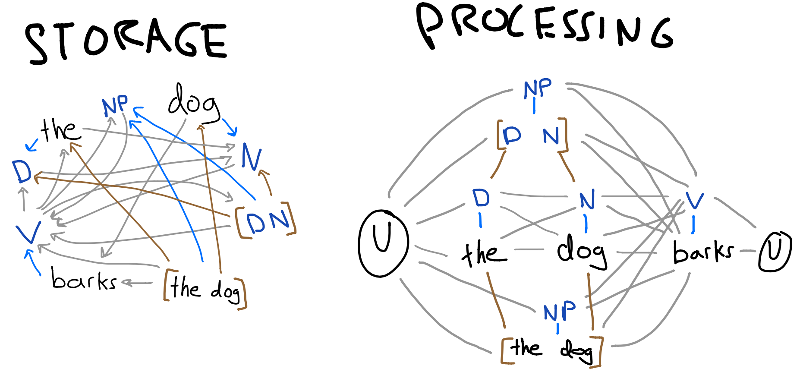

On the left you'll see the the long term knowledge. Gray arrows indicate FTP edges I guess would be somewhat high. Blue arrows indicate slot filler edges. I left out brown arrows to indicate chunk composition.

Things to note in the long term graph:

- the standard CFG rule $NP \rightarrow D\ N$ is represented in two steps: a chunking and then a categorization of a chunk.
- FTP edges can occur between all types of nodes.
- because categories will occur more frequently than base tokens and chunks, they have a higher FTP indegree.

Looking now to the right, we see the graph produced by the model in processing a very simple utterance, the dog barks. The gray edges indicate a short term temporal connection. The blue edges indicate the categorization of a specific token or chunk. The brown edges indicate the composition of two nodes into a chunk. The circled U indicates an utterance boundary, which serves as both a `start` and `end` token.

Note that the processing graph is separate from the storage graph. Thus, the nodes you see labeled `the` and `D` are not the same as the nodes in the storage graph. The reason for this separation is to allow the processing graph to contain two separate nodes that have the same label. That is, two instances of `dog` or `N` could be represented at once, with distinct edges. This is to avoid massive interference between common categories like `N`, although there are certainly other possible solutions to explore. The labels in the diagram indicate the long term node associated with the short term node.

It is my belief that the gray edges in this graph contains all the information that could be represented in the earlier proposed `ParseSet`/`StackSet`, but in a much more efficient form. Each possible paths from the left `U` to the right `U` is equivalent to one `parse`/`stack`. Each edge in the processing graph has an equivalent edge in the storage graph, thus probability is calculated as before by multiplying the weights of each edge. We could enforce the 4-node memory limit in an equivalent way, by dropping all short term temporal connections further than 4 nodes away from the frontier. However, this strategy may not make as much sense in the context of a graph. Some kind of short term activation decay may be preferable. We could even allow the model to preferentially remember connections that multiple likely parses use.

Let's turn now to the blue and brown edges that represent category membership and chunk composition respectively. Using these two edges, one can construct a parse tree for a given parse. For example, consider the topmost path: `U NP V U`. We can build a parse tree for this sentence by following the blue and brown lines until we hit a terminal.

![`[[NP [D the] [N dog]] [V barks]]`](the-dog-barks.png)

One important aspect of this framework is that, unlike with standard CFGs, a nonterminal node does not have to have a category label. The following tree corresponds to the path directly below the top path.

![`[[_ [D the] [N dog]] [V barks]]`](the-dog-barks2.png)

<!-- A critical point here is that these trees are tools for a modeler to understand the workings of the model. The models output is not the most probable tree. In fact, the brown edges are entirely for the modelers sake; the model does not ever look at the composition of a chunk once it has been created, an important restraint to maintain psychological plausibility. The brown edges are simply traces of the models merge operations, akin to a print statement embedded in a program for debugging. -->

The category and composition edges also contribute to the models assignment of path probability. The blue edges are weighted with the probability that the element be classified with the category, $P(category|element)$. The brown edges simply pass along the probability of the elements to the chunk. The edges from `the` and `dog` are each 1 because there is no doubt about the base tokens. However, in the case of `[D N]`, we must account for the fact that `D` and `N` are themselves uncertain elements.

Now that we have defined weights for each edge, we can describe how the model assigns probability to a path. We will describe it first with top down rules. Then we will describe how the model computes the probabilities bottom up.

Recursive formalism is on the way. Briefly:
1. Start with $p=1$
2. Multiply by weight of all short term temporal edges (gray)
3. Follow categorization (blue) and composition (brown) edges from all nodes on the path until you reach terminal nodes, multiplying by every edge's weight.

In practice, the model does this in left to right and then bottom up order. Nonterminal nodes are assigned probability upon their creation. Temporal edges are also constructed upon creation. A new category gets all the incoming edges as its target (categorand?) (although weights are given by the long term storage graph). A new chunk gets the incoming edges of the first element of the chunk.

Note that because the model calculates probabilities as it goes, the model does not actually need to track blue and brown edges. Each nonterminal node contains all the information encoded by the edges. We leave the edges in because it allows us to create parse trees, which allows us to connect with linguistic literature, and better understand the workings of the model. As a psychological model, we can say that the model's short term memory is simply a set of short term nodes, each of which is defined by a long term node and a set of temporal edges.

<!-- 1. $P(U) = 1$
2. $P(\alpha & a) = P(\alpha)P(a|\alpha)$ where $\alpha$ is a sequence of nodes and $a$ is a single node. $&$ indicates concatenation. This is the rule for gray edges.
3. $P(c) = P(c|) -->

