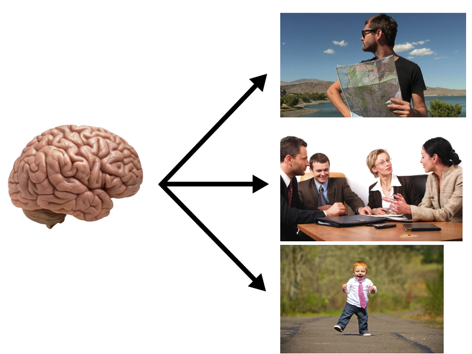
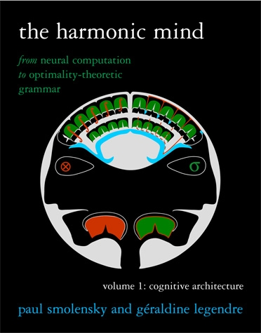

# Motivation

## What is the goal of cognitive science?

\ 

## Representation and levels of analysis

- Physical systems can be described in many ways.
- Marr's levels
    - Computation (function): What problem is being solved?
    - Algorithm: How is that problem solved?
    - Implementation: How is that solution physicially insantiated?
- To fully understand a cognitive system, we must have theories at all of these levels.

## Bridging levels of analysis
- Top-down
    - advantages
- Bottom-up
    - advantages
- complete theory

## The need for domain-general representation
- note: only at the lower levels (algorithmic?)
- parsimony
- we want systematicity
- prohibitively difficult to individually construct an implementation for algorithms in every field


# Graphical models of language

## Foobar
- bigram (image?)
    - long distance problem
    - dimensionality problem
- ADIOS/UMILA
- CBL

# Vector Symbolic Architectures

## A bridge from neurons to symbols
\ 

## Distributed representation
- "The deepest philosophical commitment of the connectionist endeavor." [@chalmers90]
- A single entity is represented by many units, \todo{each of which has little or no meaning alone.}
    - Feature vectors don't count!
- Computation with linear algebra.
- TODO neural realism

## Neural networks
\ 

## Neural networks

### Challenges
- Empirical
    - Working memory vs. lon-term memory
    - Rapid, one-trial learning
    - Self-generated knowledge
- Theoretical
    - Algorithmic explanation
    - Large-scale cognitive architecture
    <!-- Can we combine models of different areas into a cohesive picture -->

## Computation in VSAs
- Defined with algebraic operators _at the algorithmic level._
    - Contrast to networks, which can be viewed as a single operator
- Symbolic control, distributed computation.
- TODO

## Computation in VSAs

### Fundamental VSA operations [@gayler04]
- _Addition-like_ superposes vectors or adds them to a set.
- _Multiplication-like_ associates or binds vectors.
- _Permutation-like_ quotes or protects vectors from other operations.

### Fundamental VSA operations (functional)
- _bundle_ aggregates vectors into a flat, set-like representation.
- _label_ tags a content vector with a variable/role vector.
- _merge_ composes two or more vectors into a structured, tree-like representation.

<!-- TODO describe operations? (p6) -->

## TODO neurons
- @eliasmith03
- @plate95
- Each operator of a VSA can be implemented by a neural network.

# VectorGraph

## TOOD intro/motivation

## Distributional semantic models
- "You shall know a word by the company it keeps" [@firth57].
- A massive matrix with a row for each word and a column for each context.
- The meaning of a word is represented by its row.
- Dimensionality reduction (e.g. Singular Value Decomposition) compresses the dimensionality of the rows.

## Random indexing
- Online dimensionality reduction of a word-context matrix.
- _Index vector_ represents a context.
    - An immutable, $D$ dimensional, sparse vector.
- _Context vector_ represents a word.
    - A mutable, $D$ dimensional vector.
    - Initialized to $\bm{0}$.
    - The sum of index vectors for the contexts in which the word occurs.

## Random indexing __for graphs__
- Online dimensionality reduction of __an adjacency matrix.__
- __Index vector__ represents __an edge to a node.__
    - An immutable, $D$ dimensional, sparse vector.
- __Row vector__ represents __all outgoing edges of a node.__
    - A mutable, $D$ dimensional vector.
    - Initialized to $\bm{0}$.
    - The sum of index vectors for __the nodes that this node points to.__

---------

```include
operations.md
```

## Generalization 

### Categories
- foo
- the bar

--------

### Connectionist
- bar
- that foo

### Ours
- function from raw to generalized

## compositionality
- differ from traditional definition as a formal property
- approaches
    - different functions
    - labeling
    - embedded in content vectors
- our take

## simulations

